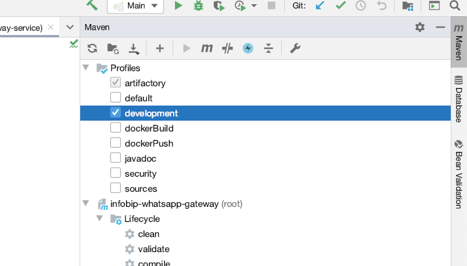

# Infobip Testcontainers Spring Boot Starter

[](https://github.com/infobip/infobip-testcontainers-spring-boot-starter/actions?query=workflow%3Amaven)
[](https://maven-badges.herokuapp.com/maven-central/com.infobip/infobip-testcontainers-spring-boot-starter)
[](https://coveralls.io/github/infobip/infobip-testcontainers-spring-boot-starter?branch=master)

Library containing Spring Boot starters which manage lifecycle (start/stop) of [testcontainers](https://www.testcontainers.org/).

Usual use cases include:
- tests (container is started during test spring context initialization and stopped during context destruction)
- local development (e.g. to remove manual setup of local DB)

## Contents

* [News](#News)
* [Usage](#Usage)
    * [MSSQL](#MSSQL)
        * [Tests](#MSSQLTests)
        * [Local development](#MSSQLLocalDevelopment)
        * [Docker image](#MSSQLDockerImage)
    * [PostgreSQL](#PostgreSQL)
        * [Tests](#PostgreSQLTests)
        * [Local development](#PostgreSQLLocalDevelopment)
        * [Docker image](#PostgreSQLDockerImage)
    * [Redis](#Redis)
        * [Tests](#RedisTests)
        * [Local development](#RedisDevelopment)
        * [Docker image](#RedisDockerImage)
    * [Kafka](#Kafka)
        * [Automatic topic creation](#KafkaTopic)
        * [Tests](#KafkaTests)
        * [Local development](#KafkaLocalDevelopment)
        * [Docker image version](#KafkaDockerImageVersion)
    * [RabbitMQ](#RabbitMq)
        * [Tests](#RabbitMqTests)
        * [Local development](#RabbitMqLocalDevelopment)
        * [Docker image](#RabbitMqDockerImage)
    * [ClickHouse](#ClickHouse)
        * [Tests](#ClickHouseTests)
        * [Local development](#ClickHouseLocalDevelopment)
        * [Docker image version](#ClickHouseDockerImageVersion)
        

## <a name="News"></a> News

### 3.2.0

####ClickHouse:
* Added support for ClickHouse
* Custom path for ClickHouse jdbc properties can be provided under `testcontainers.clickhouse.custom-path` property. In case custom path is not provided, properties under `spring.datasource` will be used

### 3.1.0

#### MSSQL: 
* username and password are now automatically injected and don't need to be explicitly set in configuration (note that they are not overriden if they do exist)
* `spring.flyway` and `spring.r2dbc` are now supported

<a name="Usage"></a>
## Usage

<a name="MSSQL"></a>
### MSSQL

**Disclaimer**: by using this testcontainer you accept the EULA for mssql docker image as [required here](https://hub.docker.com/_/microsoft-mssql-server).

<a name="MSSQLTests"></a>
#### Tests: 

Include the dependency:

```xml
<dependency>
	<groupId>com.infobip</groupId>
	<artifactId>infobip-mssql-testcontainers-spring-boot-starter</artifactId>
	<version>${infobip-mssql-testcontainers-spring-boot-starter.version}</version>
	<scope>test</scope>
</dependency>
```

jTDS:

```yaml
spring:
  datasource:
    url: jdbc:jtds:sqlserver://<host>:<port>/FooBarDb
```

Microsoft driver:

```yaml
spring:
  datasource:
    url: jdbc:sqlserver://<host>:<port>;database=FooBarDb
```

Logical database is automatically created.
Container IP address is resolved based on running host, meaning on local machine `<host>` will resolve to `localhost`
while inside Docker placeholder will resolve to `containerIp`.
Docker container is mapped on random port so `<port>` placeholder is used and will be automatically substituted.

<a name="MSSQLLocalDevelopment"></a>
#### Local Development: 

Add the following profile:

```xml
<profiles>
    <profile>
        <id>development</id>
        <dependencies>
            <dependency>
                <groupId>com.infobip</groupId>
                <artifactId>infobip-mssql-testcontainers-spring-boot-starter</artifactId>
                <version>${infobip-mssql-testcontainers-spring-boot-starter.version}</version>
            </dependency>
        </dependencies>
    </profile>
</profiles>
```

Before starting the application locally, activate development profile:



and update your local configuration (e.g. application-development.yaml):

jTDS:

```yaml
spring:
  datasource:
    url: jdbc:jtds:sqlserver://<host>:<port>/FooBarDb_test_${user.name}
```

Microsoft driver:

```yaml
spring:
  datasource:
    url: jdbc:sqlserver://<host>:<port>;database=FooBarDb_test_${user.name}
```

<a name="MSSQLDockerImage"></a>
#### Docker image: 

To change the docker image used simply add the following property (e.g. in yaml):

```yaml
testcontainers.mssql.docker.image: mcr.microsoft.com/mssql/server:2017-CU12
```

<a name="PostgreSQL"></a>
### PostgreSQL

<a name="PostgreSQLTests"></a>
#### Tests: 

Include the dependency:

```xml
<dependency>
	<groupId>com.infobip</groupId>
	<artifactId>infobip-postgresql-testcontainers-spring-boot-starter</artifactId>
	<version>${infobip-postgresql-testcontainers-spring-boot-starter.version}</version>
	<scope>test</scope>
</dependency>
```

Configuration:

```yaml
spring:
  datasource:
    url: jdbc:postgresql://<host>:<port>/FooBarDb
    username: test
    password: test
```

Logical database is automatically created.
Container IP address is resolved based on running host, meaning on local machine `<host>` will resolve to `localhost`
while inside Docker placeholder will resolve to `containerIp`.
Docker container is mapped on random port  so `<port>` placeholder is used and will be automatically substituted.

<a name="PostgreSQLLocalDevelopment"></a>
#### Local Development: 

Add the following profile:

```xml
<profiles>
    <profile>
        <id>development</id>
        <dependencies>
            <dependency>
                <groupId>com.infobip</groupId>
                <artifactId>infobip-postgresql-testcontainers-spring-boot-starter</artifactId>
                <version>${infobip-postgresql-testcontainers-spring-boot-starter.version}</version>
                <scope>test</scope>
            </dependency>
        </dependencies>
    </profile>
</profiles>
```

Before starting the application locally, activate development profile:


and update your local configuration (e.g. application-development.yaml):

```yaml
spring:
  datasource:
    url: jdbc:postgresql://<host>:<port>/FooBarDb_test_${user.name}
    username: test
    password: test
```

<a name="PostgreSQLDockerImage"></a>
#### Docker image: 

To change the docker image used simply add the following property (e.g. in yaml):

```yaml
testcontainers.postgresql.docker.image: postgres:10
```

<a name="Redis"></a>
### Redis

<a name="RedisTests"></a>
#### Tests: 

Include the dependency:

```xml
<dependency>
	<groupId>com.infobip</groupId>
	<artifactId>infobip-redis-testcontainers-spring-boot-starter</artifactId>
	<version>${infobip-redis-testcontainers-spring-boot-starter.version}</version>
	<scope>test</scope>
</dependency>
```

Configuration:

```yaml
spring:
  redis:
    url: redis://<host>:<port>
```

Container IP address is resolved based on running host, meaning on local machine `<host>` will resolve to `localhost`
while inside Docker placeholder will resolve to `containerIp`.
Docker container is mapped on random port so `<port>` placeholder is used and will be automatically substituted.

<a name="RedisDevelopment"></a>
#### Local Development: 

Add the following profile:

```xml
<profiles>
    <profile>
        <id>development</id>
        <dependencies>
            <dependency>
                <groupId>com.infobip</groupId>
                <artifactId>infobip-redis-testcontainers-spring-boot-starter</artifactId>
                <version>${infobip-redis-testcontainers-spring-boot-starter.version}</version>
                <scope>test</scope>
            </dependency>
        </dependencies>
    </profile>
</profiles>
```

Before starting the application locally, activate development profile:


and update your local configuration (e.g. application-development.yaml):

```yaml
spring:
  redis:
    url: redis://<host>:<port>
```

<a name="RedisDockerImage"></a>
#### Docker image: 

To change the docker image used simply add the following property (e.g. in yaml):

```yaml
testcontainers.redis.docker.image: redis:5.0.7-alpine
```

<a name="Kafka"></a>
### Kafka

<a name="KafkaTopic"></a>
#### Automatic topic creation

Format: `<topicName>:<numPartitions>:<replicationFactor>`

```yaml
testcontainers.kafka.topics: test-topic:1:1, test-topic-2:1:1
```

<a name="KafkaTests"></a>
#### Tests: 

Include the dependency:

```xml
<dependency>
	<groupId>com.infobip</groupId>
	<artifactId>infobip-kafka-testcontainers-spring-boot-starter</artifactId>
	<version>${infobip-kafka-testcontainers-spring-boot-starter.version}</version>
	<scope>test</scope>
</dependency>
```

Configuration:

```yaml
spring:
  kafka:
    bootstrap-servers: <host>:<port>
```

Logical database is automatically created.
Container IP address is resolved based on running host, meaning on local machine `<host>` will resolve to `localhost`
while inside Docker placeholder will resolve to `containerIp`.
Docker container is mapped on random port so `<port>` placeholder is used and will be automatically substituted.

<a name="KafkaLocalDevelopment"></a>
#### Local Development: 

Add the following profile:

```xml
<profiles>
    <profile>
        <id>development</id>
        <dependencies>
            <dependency>
                <groupId>com.infobip</groupId>
                <artifactId>infobip-kafka-testcontainers-spring-boot-starter</artifactId>
                <version>${infobip-kafka-testcontainers-spring-boot-starter.version}</version>
                <scope>test</scope>
            </dependency>
        </dependencies>
    </profile>
</profiles>
```

Before starting the application locally, activate development profile:


and update your local configuration (e.g. application-development.yaml):

```yaml
spring:
  kafka:
    bootstrap-servers: <host>:<port>
```

<a name="KafkaDockerImage"></a>
#### Docker image: 

To change the docker image version used simply add the following property (e.g. in yaml):

```yaml
testcontainers.kafka.docker.image.version: 2.1.0
```

<a name="RabbitMq"></a>
### RabbitMq

<a name="RabbitMqTests"></a>
#### Tests: 

Include the dependency:

```xml
<dependency>
	<groupId>com.infobip</groupId>
	<artifactId>infobip-rabbitmq-testcontainers-spring-boot-starter</artifactId>
	<version>${infobip-rabbitmq-testcontainers-spring-boot-starter.version}</version>
	<scope>test</scope>
</dependency>
```

#### Test Configuration:

To configure RabbitMq in tests you need to create it's configuration for example:

```java
@Configuration
@Profile({"test", "development"})
public class RabbitConfigTestEnv {

    @Bean
    public Queue testQueue() {
        return QueueBuilder.durable("test.queue").build();
    }

    @Bean
    public TopicExchange testExchange() {
        return new TopicExchange("test.exchange");
    }

    @Bean
    public Binding bindToTestExchange() {
        return bind(testQueue()).to(testExchange()).with("test.key.#");
    }
}
```

This class should live inside test files and there you can create queues, exchanges and key routing bindings or receivers.
In this example method:
* `testQueue` creates queue with name `test.queue`
* `testExchange` creates exchange with name `test.exchange`
* `bindToTestExchange` tells Rabbit to send any message sent to test exchange, with key of value `test.key.#` to our test queue

<b>Important</b>: Queues are declared in Rabbit only after some message is sent to the queue.
If you log into `docker` and try to find queue, it won't be listed if no message was sent to it.

<a name="RabbitMqLocalDevelopment"></a>
#### Local Development: 

Add the following profile:

```xml
<profiles>
    <profile>
        <id>development</id>
        <dependencies>
            <dependency>
                <groupId>com.infobip</groupId>
                <artifactId>infobip-rabbitmq-testcontainers-spring-boot-starter</artifactId>
                <version>${infobip-rabbitmq-testcontainers-spring-boot-starter.version}</version>
                <scope>test</scope>
            </dependency>
        </dependencies>
    </profile>
</profiles>
```

Before starting the application locally, activate development profile:


<a name="RabbitMqDockerImage"></a>
#### Docker image: 

To change the docker image used simply add the following property (e.g. in yaml):

```yaml
testcontainers.rabbit.docker.image: rabbitmq:3.6.14-alpine
```
<a name="ClickHouse"></a>
### ClickHouse

<a name="ClickHouseTests"></a>
####Tests

Include the dependency:

```xml
<dependency>
	<groupId>com.infobip</groupId>
	<artifactId>infobip-clickhouse-testcontainers-spring-boot-starter</artifactId>
	<version>${infobip-clickhouse-testcontainers-spring-boot-starter.version}</version>
	<scope>test</scope>
</dependency>
```

<a name="ClickHouseLocalDevelopment"></a>
####Local development

Add the following profile:

```xml
<profiles>
    <profile>
        <id>development</id>
        <dependencies>
            <dependency>
                <groupId>com.infobip</groupId>
                <artifactId>infobip-clickhouse-testcontainers-spring-boot-starter</artifactId>
                <version>${infobip-clickhouse-testcontainers-spring-boot-starter.version}</version>
                <scope>test</scope>
            </dependency>
        </dependencies>
    </profile>
</profiles>
```

Before starting the application locally, activate development profile:


<a name="ClickHouseDockerImageVersion"></a>

and update your local configuration (e.g. application-development.yaml):

```yaml
spring:
  datasource:
    jdbc-url: <host>:<port>
```
In case your datasource configuration is different from default one you can provide custom configuration property path
```yaml
    testcontainers.clickhouse.custom-path: "spring.datasource.clickhouse"
```
in this case your configuration would look like this

```yaml
spring:
  datasource:
      clickhouse:
        jdbc-url: <host>:<port>
```

####Docker image version

To change the docker image used simply add the following property (e.g. in yaml):

```yaml
testcontainers.clickhouse.docker.image: rabbitmq:latest
```

## <a name="Contributing"></a> Contributing

If you have an idea for a new feature or want to report a bug please use the issue tracker.

Pull requests are welcome!

## <a name="License"></a> License

This library is licensed under the [Apache License, Version 2.0](http://www.apache.org/licenses/LICENSE-2.0).

